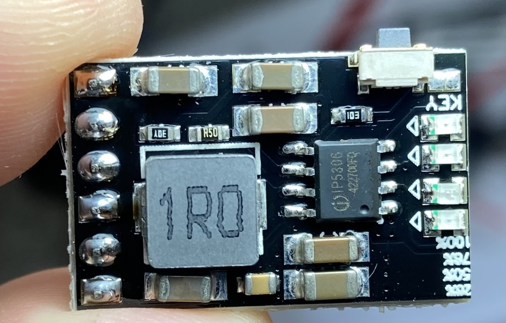
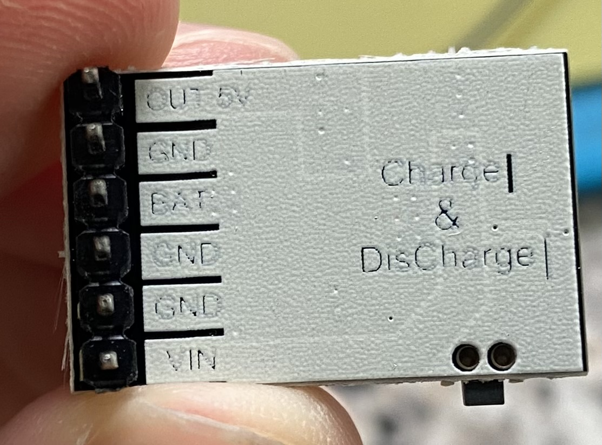

# IP5306_Heartbeat_Circuit_Sketch

[](img/frontb.jpg)

[](img/backb.jpg)

Over the past few years I have been using the IP5306 chip and specifically the module shown in the image above.

The mpdule is a great all in one solution for LiPo battery powered projects: charge, discharge, protection, 5v step up etc.

That being said there is 1 massively annoying caveat:

If the load current drops below 45mA during 32 seconds, the IP5306 will go into standby mode...

For low power battery operations this is simply unacceptable.. and I will not simply increase the current draw to keep it on.

There is and I2C version which allows us to change a few settings like standby mode in the IP5306 but for this fix I will focus on the "dumb version".

## Solution

An easy solution is to create a simple heartbeat solution.

Since there is a button which will prevent the IC from going into standby mode, if pressed it will reset the 32 seconds 45mA timer.

The module I have also has a solder pad where I can easily solder a wire to control this button via an MCU.

Using a BC457 NPN transistor we can create a simple switch to "press the button" at least once within the 32 seconds within a loop.

In this way we can constantly keep the module powered.

## Parts

- NPN transistor (I used the BC547B)
- resistor (1k is fine)
- hookup wires

## Connections

The Base connects to the resistor and then your MCU pin of choice.

Emitter gets connected to GND.

Collector gets solddered to the button pad.

## Code

Once everything is soldered and double checked you can then add the code for the heartbeat.

In this case I use the millis() function and a simple repeating timer all written in a sketch `.ino`


```C
/*
 * IP5306 Heartbeat sketch
 *
 * Arduino ATtiny412 IP5306 Heartbeat
 *
 * @category   Heartbeat sketch examples
 * @package    Power Sketch
 * @author     C.A Torino
 * @version    V1.2.0
 * @since      26nd March 2020
 * @hardware   ATTINY412 Modified
 * @notes      -
 *
 */

#define IP5306_HEARTBEAT_PIN PIN3_bm//PA3 PIN3_bm PIN_PA3

unsigned long Delay_IP5306_Heartbeat;
unsigned long Delay_IP5306_Heartbeat_Led;

const unsigned long IP5306_HEARTBEAT_TIMEOUT = 15000;//loop every 15s

const unsigned long HOLD_TIME = 150;//time to hold button

bool ButtonD = false;

void setup() 
{
  PORTA.DIRSET = IP5306_HEARTBEAT_PIN;//set output
  PORTA.PIN3CTRL = PORT_PULLUPEN_bm;//initiate learn pin pullup PIN3CTRL = PIN3_bm
  Delay_IP5306_Heartbeat_Led = Delay_IP5306_Heartbeat = millis();//set to current millis at start
  PORTA.OUTCLR = IP5306_HEARTBEAT_PIN;//write low do this after setting output and pullup
}

 void IP5306_Heartbeat() 
{
  /*
  # If button is pushed longer than 30ms but shorter than 2s, IP5306 will identify the action as short push. Short push will open SOC indicator LEDs and step-up converter
  # If button is pushed longer than 2s, IP5306 will identify the action as long push. Long push will close step-up convertor, SOC indicator LED and flashlight LED.
  # If button is pushed shorter than 30ms, IP5306 will ignore the action.
  # If two short push is detected within 1s, IP5306 will open or close flashlight LED
  */
    if (!ButtonD && (millis() - Delay_IP5306_Heartbeat) >= IP5306_HEARTBEAT_TIMEOUT)
    {
      ButtonD=true;//set bool in order to go to next else if
      Delay_IP5306_Heartbeat_Led = IP5306_HEARTBEAT_TIMEOUT+HOLD_TIME; //add holdtime to heartbeat
      PORTA.OUTSET = IP5306_HEARTBEAT_PIN;//write high, NPN is ON here
    }
    else if (ButtonD && (millis() - Delay_IP5306_Heartbeat) >= (Delay_IP5306_Heartbeat_Led))
    {
      ButtonD=false;//set !bool once holdtime ends
      Delay_IP5306_Heartbeat += IP5306_HEARTBEAT_TIMEOUT; //prevents drift
      PORTA.OUTCLR = IP5306_HEARTBEAT_PIN;//write low, NPN is OFF here
    }
}

void loop() 
{
  IP5306_Heartbeat();//keep in loop for accurate results
}

```


